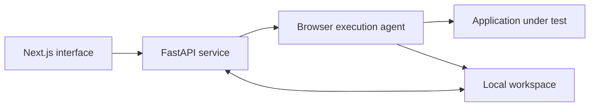

# VeriSentinel-QA

**From product requirements to test evidence and release decisions.**

VeriSentinel-QA is a full-stack quality assurance application that connects a website URL and product requirements to executable browser tests, observable results, defect tracking and release review. It brings preparation, execution and sign-off into a single local workspace.

## Features

- **Requirements management:** upload PDF, DOCX, Markdown or text documents, review extracted requirements and edit acceptance criteria.
- **Test preparation:** generate test proposals from requirements and discovered pages, import CSV/XLSX cases, or write executable steps manually. Review and approve drafts before execution.
- **Controlled browser testing:** discover application pages, execute approved tests with Playwright, pause a run and take manual control when needed.
- **Evidence-backed results:** inspect assertion outcomes, screenshots, traces, session videos, console messages and network metadata.
- **Defect lifecycle:** create issues from results, record a fix and verify linked issues through a passing re-test.
- **Release gates:** track requirement coverage, current test results and blocking issues before QA validation and developer sign-off.
- **Local persistence:** retain project data and evidence between sessions, with serialized writes and atomic file replacement.

## Technology

| Layer | Stack |
| --- | --- |
| Interface | Next.js, React, TypeScript, Tailwind CSS |
| API and validation | FastAPI, Python, Pydantic |
| Browser execution | Node.js, TypeScript, Playwright |
| Document and spreadsheet import | pypdf, docx2txt, pandas, openpyxl |
| Test proposal generation | Gemini or a locally configured Ollama model |
| Storage | Local JSON workspace and evidence files |

## Architecture



The frontend forwards `/api` requests to the Python service. The execution agent controls the testing browser and records evidence against project, requirement and test identifiers.

| Service | Local address |
| --- | --- |
| Application | `http://127.0.0.1:3000` |
| Python API | `http://127.0.0.1:8000` |
| Browser agent | `http://127.0.0.1:4318` |
| Launcher and configuration | `http://127.0.0.1:4319` |
| Supplied shop demo | `http://127.0.0.1:4180` |

## Windows setup

Install Node.js 22.13 or later, Python 3.12 and Git. Run these commands in PowerShell:

```powershell
git clone https://github.com/KIRIT-P-S/VeriSentinel-QA.git
cd VeriSentinel-QA
python -m venv backend/venv
backend/venv/Scripts/python.exe -m pip install -r backend/requirements.txt
npm run setup
node agent/node_modules/playwright/cli.js install chromium
npm run build
```

For test generation, double-click **Configure AI.cmd**, enter your own Gemini API key and save the settings. The form also lets you continue without changing settings. Imported executable tests and manual editing work without a configured generation provider.

Double-click **Start AI QA Studio.cmd** to start the services and open the application. Keep the launcher window open. Use **Stop AI QA Studio.cmd** to finish the session and preserve saved projects.

The same actions are available from the terminal:

```powershell
node scripts/desktop.cjs configure
node scripts/desktop.cjs start
node scripts/desktop.cjs stop
```

Run configuration while the application is stopped. The start command remains active until the application stops; use another terminal for the stop command.

## Mac setup

On macOS 14 or later, clone or extract the repository into its final writable local folder, then open **Setup Mac.command**. The installer detects Apple Silicon or Intel, downloads checksum-verified tools, prepares Python 3.12, installs dependencies and Chromium, and builds the application. Internet access is required for first-time setup.

After setup, use **Configure AI.command**, **Start AI QA Studio.command** and **Stop AI QA Studio.command**. The installer performs native Python import checks and an actual browser assertion before marking the installation ready. The complete Mac workflow still requires validation on the target Mac.

If a downloaded launcher is blocked as **Not Opened**, the scripts are unsigned and not notarized. For a trusted, reviewed download, dismiss the dialog with **Done**, then use **System Settings > Privacy & Security > Open Anyway** for that launcher and confirm **Open**. Approval may be required for each launcher. Managed Macs may require administrator approval. See [Apple's opening instructions](https://support.apple.com/en-us/102445). Complete setup before running configuration or start.

## Testing workflow

1. Create a project with an application URL, owner and environment.
2. Upload the product requirements and review their acceptance criteria.
3. Generate, import or manually create tests. Link each test to its requirements.
4. Connect the application, complete any login steps manually and give control to the execution agent.
5. Review and approve the selected tests, then execute the plan.
6. Inspect results and evidence. Create issues for failures, record fixes and re-run affected tests.
7. Review requirement coverage and unresolved issues, confirm QA validation and complete developer sign-off.
8. Disconnect the browser to finalize its session video, then export the report.

Tests contain explicit assertions such as visible text, input values, URLs or API responses. Database assertions require a separately configured read-only account. Login challenges and actions requiring human approval pause for manual completion.

## Try the supplied demo

Start **Start Client Demo.cmd** on Windows or **Start Client Demo.command** on Mac, then run **Load Demo Project** with the matching extension. This creates six requirements and eight linked draft tests; review and approve them before execution.

With the demo cart bug enabled, the supplied plan produces seven passes and one failure in TC07. Create an issue from that failure, switch the [demo control page](http://127.0.0.1:4180/control) to **Fixed**, mark the issue fixed and re-run TC07 without changing its expectations. The passing re-test verifies the issue and restores coverage for the supplied plan.

The [demo PRD](examples/manual-test-pack/Shop_QA_Demo_PRD.md) and [executable test CSV](examples/manual-test-pack/Test_Cases_Executable.csv) are included. The demo can run without a generation-provider API key.

## Development checks

After installing dependencies and building the frontend:

```powershell
npm run check
backend/venv/Scripts/python.exe -m unittest discover -s backend/tests -v
node scripts/tests/desktop-platform.test.cjs
node agent/node_modules/tsx/dist/cli.mjs --test agent/tests/domain.test.ts agent/tests/searchSafety.test.ts
```

On Mac, use `backend/venv/bin/python` for the Python test command. These suites check step validation, test proposal correction, requirement coverage, release invalidation, concurrent storage, action boundaries and platform launch settings.

`npm run test:e2e` exercises a local browser fixture and requires the application and agent to be running, plus installed Google Chrome. Run it with a separate `STUDIO_DATA_DIR` and `STUDIO_HEADLESS=true` so verification results are isolated from working projects.

## Workspace and configuration

| Path | Purpose |
| --- | --- |
| `web/app` and `web/components` | Application routes and interface |
| `web/lib/studio` | Shared models, validation and storage helpers |
| `backend` | Project API, imports, generation and workflow rules |
| `agent/src` | Browser control, execution, evidence and database checks |
| `scripts` | Service launchers and platform setup |
| `examples/manual-test-pack` | Shop fixture, requirements and supplied cases |
| `web/data/studio` | Runtime project data and evidence; excluded from Git |
| `web/.env.local` | Local provider configuration; excluded from Git |
| `.desktop/logs` | Launcher service logs; excluded from Git |

The configuration form saves settings locally in `web/.env.local`. For manual configuration, use [web/.env.example](web/.env.example) as a template and restart the services. Ollama configuration uses `AI_PROVIDER=ollama`, `OLLAMA_URL` and `OLLAMA_MODEL`; the selected model must be installed and running.

Back up the entire `web/data/studio` folder while the application is stopped. Generated proposals require review; requirement coverage describes the linked assertions that passed and does not establish exhaustive correctness. The application currently serves a local single-user workspace, and reviewer names are recorded labels rather than authenticated signatures. Requirements and observed page context are sent to the configured generation provider when generation is requested.
